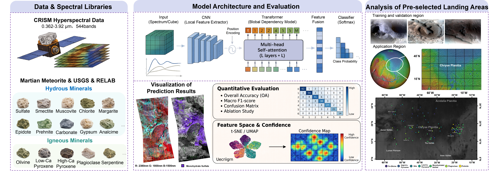

# Hybrid CNN-Transformer with Multi-Source Spectral Prior Alignment for Martian Hydrated Mineral Identification

[](https://www.python.org/)
[](https://pytorch.org/)
[](https://opensource.org/licenses/MIT)

> **Official PyTorch Implementation** for the paper:  
> *"[ Mapping Hydrated Minerals in Chryse Planitia, Mars via a Meteorite-Constrained CNN-Transformer Architecture: Revealing Fine-Scale Aqueous Alteration Records]"* (Submitted / Under Review).

---

## 📌 Overview & Key Highlights

This repository contains the code and cartographic pipeline for identifying and mapping Martian hydrated minerals from CRISM hyperspectral observations. The framework couples a dual-branch deep architecture with physical laboratory priors and cross-regional domain adaptation.

<p align="center">
  
  <br>
  <em>Graphic Abstract</em>
</p>

### Core Contributions
1. **Dual-Branch Hybrid Architecture (1D-CNN + Spectral Transformer)**:
   * **Local 1D-CNN Branch**: 4-layer 1D convolutional backbone (channels: 32 -> 64 -> 128 -> 128) with BatchNorm and MaxPool to capture sharp diagnostic absorption doublets.
   * **Global Spectral Transformer Branch**: Splits 256-band spectra into 32 tokens (patch size = 8), with sinusoidal positional embeddings and a learnable `[CLS]` token to model long-range spectral envelope dependencies.
   * **Feature Fusion**: Concatenates local (128-d) and global (128-d) vectors and projects them into a unified 128-d latent representation space.
2. **Multi-Source Spectral Prior Alignment**:
   * Bridges orbital observations with laboratory spectral libraries: **USGS splib07a**, **RELAB Meteorite analogs**, and **RELAB Terrestrial Hydrated Minerals**.
   * Employs a cosine-based **Prior Prototype Loss** (weight = 0.20) to constrain orbital feature clusters toward physical ground-truth endmembers.
3. **Class-Conditional Cross-Region Alignment**:
   * **Pull Loss**: Minimizes intra-class distribution divergence across different regions (HC, NF, UP).
   * **Push Loss**: Enforces margin separation (margin = 0.25, weight = 0.50) between disparate mineral classes across geographic domains.
4. **Cartographic Mapping & Visualization Pipeline**:
   * Recursive discovery of nested CRISM cubes (`*if*.hdr`).
   * Albedo base-map modulation via wide-band median filter (1200 ~ 1400 nm).
   * 4-channel RGBA rendering with full alpha-masking of dead/border pixels and locked 1:1 metric aspect ratio (`aspect='equal'`).
   * Automated PDS label (`*.lbl`) parsing for bounding box coordinate extraction.

---

## 💎 Mineral Taxonomy & Color Palette

The framework unifies Martian mineralogy into **15 diagnostic mineral classes**. The standardized hex codes and RGB triplets for cartographic plotting are defined as follows:

| Label ID | Mineral Class | RGB Palette | Hex Code |
| :---: | :--- | :---: | :---: |
| **0** | Analcime | `[140, 67, 46]` | `#8C432E` |
| **1** | Bassanite | `[0, 0, 255]` | `#0000FF` |
| **2** | Chlorite | `[255, 100, 0]` | `#FF6400` |
| **3** | Epidote | `[0, 255, 200]` | `#00FFC8` |
| **4** | Fe-Olivine | `[164, 75, 155]` | `#A44B9B` |
| **5** | High-Ca Pyroxene (HCP/CPX) | `[101, 174, 255]` | `#65AEFF` |
| **6** | Illite / Muscovite | `[118, 254, 254]` | `#76FEFE` |
| **7** | Low-Ca Pyroxene (LCP/OPX) | `[60, 91, 112]` | `#3C5B70` |
| **8** | Margarite | `[255, 255, 0]` | `#FFFF00` |
| **9** | Mg-Carbonate | `[255, 255, 255]` | `#FFFFFF` |
| **10** | Mg-Smectite | `[255, 0, 255]` | `#FF00FF` |
| **11** | Monohydrated sulfate | `[100, 0, 255]` | `#6400FF` |
| **12** | Plagioclase | `[0, 200, 254]` | `#00C8FE` |
| **13** | Prehnite | `[0, 255, 0]` | `#00FF00` |
| **14** | Serpentine | `[171, 175, 80]` | `#ABAF50` |

---

## 🛰️ Dataset & Spectral Calibration

* **Spectral Target Interval**: 1021.0 nm ~ 2635.0 nm (1.021 ~ 2.635 µm), targeting diagnostic vibrational overtone and combination bands (M-OH, H2O, SO4, CO3).
* **Model Input Dimension**: 256 bands (interpolated and aligned).
* **Laboratory Prior Baseline**: 425 uniform bands (1.021 ~ 2.635 µm) processed via Convex Hull Continuum Removal (CR).
* **Regional Domains**:
  * `0`: Hebes Chasma & surrounding regions (`HC`)
  * `1`: Nili Fossae (`NF`)
  * `2`: Utopia Planitia (`UP`)
* **Preprocessing Pipeline**:
  * Linear interpolation to eliminate non-finite (`NaN` / `Inf`) artifacts.
  * Percentile-clipped min-max scaling (1st ~ 99th percentiles) to prevent dynamic range skewing.
  * Reflectance quality thresholds: `REFLECTANCE_MIN_THRESH = 0.005`, `SPECTRUM_DIV_THRESH = 0.003`.

---

## 📂 Repository Structure

```text
.
├── graphic_abstract.png             # Graphical abstract / workflow overview
├── LICENSE                          # MIT License
├── README.md                        # Documentation and reproduction guide
├── demo.py                          # Quickstart demo for mineral mapping and interactive visualization
├── data/
│   ├── demo/                        # Lightweight CRISM demo patch for quick verification
│   │   ├── frt00009e39_07_if166j_mtr3_demo.dat  # ENVI binary cube (~11.7 MB)
│   │   └── frt00009e39_07_if166j_mtr3_demo.hdr  # ENVI header file
│   ├── dataset/                     # Preprocessed unified benchmark dataset (HC, NF, UP)
│   │   ├── all_spectra_unified.npy  # Aligned spectral reflectance matrix (~64 MB)
│   │   ├── all_labels_unified.npy   # Ground-truth mineral class labels
│   │   ├── all_region_ids_unified.npy # Region IDs for cross-domain evaluation
│   │   └── *.csv / *.json           # Class statistics and metadata tables
│   ├── prior_library/               # Resampled laboratory prior tensors (*.pt)
│   └── *.csv                        # Expert database metadata tables
├── models/
│   ├── final_train_unified_hybrid_transformer_allpriors.py # Main training: Hybrid CNN-Transformer + Priors + Region Loss
│   ├── final_train_unified_hybrid_no_prior.py              # Ablation: Hybrid model without physical priors
│   ├── final_unified_model_allpriors_ccalign.py            # Ablation: 1D-CNN backbone baseline
│   └── predict_final_all.py                                # Batch inference script with Top-5 reporting
├── utils/
│   ├── RELAB_resample.py                    # Preprocessing: Ingests RELAB spectra to CRISM bands
│   ├── USGS_resample.py                     # Preprocessing: Applies continuum removal to USGS splib07a
│   └── inspect_all_prior_wavelength.py      # Diagnostic: Verifies prior tensor shapes and monotonicity
├── visualization/
│   ├── visualization_with_legend.py         # Shaded-relief modulation with built-in legend
│   └── visualization_with_location_info.py  # RGBA transparent patches and PDS coordinate extraction
└── weights/
    ├── best_model.pt                        # Trained checkpoint of the full model (~1.8 MB)
    └── best_model_no_prior.pt               # Trained checkpoint without prior constraints (~1.8 MB)
```

---

## ⚙️ Environment Setup

Ensure Python >= 3.9 and CUDA are available:

```bash
# 1. Clone repository
git clone https://github.com/RamkiEdogawa/Martian-Hydrated-Mineral-CNN-Transformer.git
cd <your-repo-name>

# 2. Setup Conda environment
conda create -n mars_mineral python=3.10 -y
conda activate mars_mineral

# 3. Install PyTorch (adjust to your CUDA version, e.g., cu121)
pip install torch torchvision --index-url https://download.pytorch.org/whl/cu121

# 4. Install dependencies
pip install -r requirements.txt
```

---

## 🚀 Quick Verification (Demo)

Verify the trained model pipeline on local demonstration samples:

```bash
python demo.py
```

Expected terminal output:
```text
================================================================================
🚀 Running Interactive CRISM Mineral Mapping Demonstration
📦 Computing Device   : cuda
🔬 Checkpoint Path    : *\weights\best_model.pt
📁 Target Scan Root   : *\data\demo
🎯 Display Rank Range : Rank 2 to Rank 5
================================================================================

🔎 Located 1 hyperspectral cube(s). Processing demo scene...
[01/01] 📄 Analyzing Scene: frt00009e39_07_if166j_mtr3_demo
--------------------------------------------------------------------------------
  • Dimensions : Height=107, Width=115, Bands=244

📊 Mineral Spatial Area & Abundance Ranking:
  Total Valid Mineral Pixels: 12,305
  Display Filter : Rank 2 to Rank 5

  Rank  Status          Mineral Name            Pixel Area    Coverage (%)
  --------------------------------------------------------------------
  1     ❌ [Filtered]    Fe-Olivine              8,619          70.04%
  2     ✅ [Displayed]   Monohydrated sulfate    1,511          12.28%
  3     ✅ [Displayed]   Plagioclase             769             6.25%
  4     ✅ [Displayed]   Low-Ca Pyroxene         643             5.23%
  5     ✅ [Displayed]   Illite/Muscovite        447             3.63%
  6     ❌ [Filtered]    Prehnite                239             1.94%
  7     ❌ [Filtered]    Epidote                 74              0.60%
  8     ❌ [Filtered]    Chlorite                2               0.02%
  9     ❌ [Filtered]    High-Ca Pyroxene        1               0.01%
  --------------------------------------------------------------------

🖼️ Displaying interactive visualization window (close window to proceed)...

================================================================================
🎯 Demonstration completed successfully!
================================================================================
```

---

## 🏋️ Model Training & Ablations

All models are trained with `AdamW` (lr = 1e-3, weight decay = 1e-4), batch size 256, stratified 85/15 train/val split, and `ReduceLROnPlateau` monitoring validation Macro-F1.

### 1. Unified Hybrid CNN-Transformer (Full Model)
```bash
python final_train_unified_hybrid_transformer_allpriors.py
```

Multi-task loss objective:

$$\mathcal{L} = \mathcal{L}_{\text{cls}} + 0.20 \cdot \mathcal{L}_{\text{proto}} + 0.20 \cdot \mathcal{L}_{\text{region}}$$

### 2. Ablation: Without Physical Priors
```bash
python final_train_unified_hybrid_no_prior.py
```

### 3. Ablation: 1D-CNN Backbone Baseline
```bash
python final_unified_model_allpriors_ccalign.py
```

---

## 🗺️ Cartographic Mapping & Visualizations

To project mineral predictions over CRISM observations with 3D shaded relief modulation:

```bash
# 1. Generate full publication maps with legend
python visualization_with_legend.py --cube_dir /path/to/crism_cubes/

# 2. Export transparent RGBA patches and a .csv matrix file and a global legend
python visualization_with_location_info.py --input_dir /path/to/crism_cubes/ --output_dir ./map_outputs/
```

---

## 📥 External Data Sources

* **CRISM Targeted Observations (PDS)**: Raw and photometric-corrected observations (I/F cubes in `.img` / `.hdr` formats) are available from the [NASA PDS Geosciences Node](https://pds-geosciences.wustl.edu/) and [MarsSI](https://marssi.univ-lyon1.fr/).
* **RELAB Spectral Database**: Sourced from the [Brown University RELAB Database](https://sites.brown.edu/relab/).
* **USGS Spectral Library**: Sourced from the [USGS splib07a](https://crustal.usgs.gov/speclab/QueryAll07a.php).

---

## ⚖️ License
This project is licensed under the MIT License - see the [LICENSE](LICENSE) file for details.